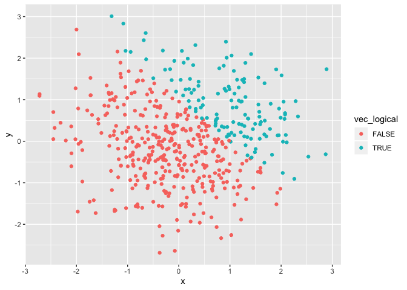
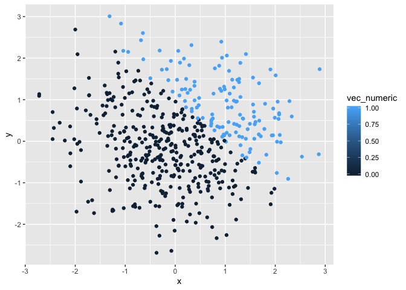
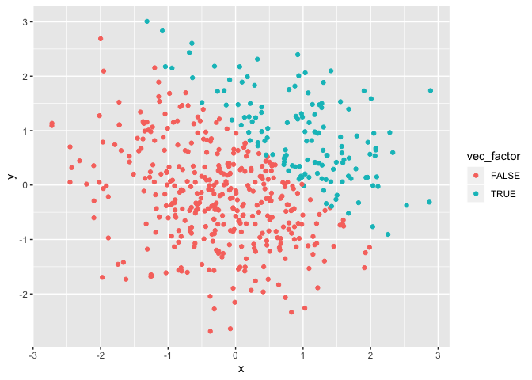

p8105\_hw1\_mm5351
================
Martha Mulugeta
2019-09-14

**Problem 1:** *Create a data frame with a random sample of size 8 from
a standard Normal distribution, a logical vector indicating whether
elements of the sample are greater than 0, a character vector of length
8, and a factor vector of length 8 with 3 different factor “levels”.
Take the means of each variable in the
    dataframe.*

``` r
library(tidyverse)
```

    ## ── Attaching packages ─────────────────────────────────────────────── tidyverse 1.2.1 ──

    ## ✔ ggplot2 3.2.1     ✔ purrr   0.3.2
    ## ✔ tibble  2.1.3     ✔ dplyr   0.8.3
    ## ✔ tidyr   0.8.3     ✔ stringr 1.4.0
    ## ✔ readr   1.3.1     ✔ forcats 0.4.0

    ## ── Conflicts ────────────────────────────────────────────────── tidyverse_conflicts() ──
    ## ✖ dplyr::filter() masks stats::filter()
    ## ✖ dplyr::lag()    masks stats::lag()

``` r
##Create dataframe
set.seed(1)
hw1_df = tibble(
sample = rnorm(8),
vec_logical = c(sample > 0),
vec_char = c(length = 8),
vec_factor = factor(c(length = 8)), levels = c(3),

##Take means of each variable
mean(sample),
mean(vec_logical),
mean(vec_char),
mean(vec_factor),
)
```

    ## Warning in mean.default(vec_factor): argument is not numeric or logical:
    ## returning NA

The means of the sample, logical vector and character vector were
produced. However, the mean for the factor vector was not applicable.
This is likely because factor variables represent categories, and the
average of cannot be taken of categories. The logical vector produced
“True” or “False” variables coded as 1 and 0 respectively. Therefore,
a mean can be taken of those values. The sample and character vector
both contained numbers, of which means are easily calculated.

*Write a code chunk that applies the as.numeric function to the logical,
character, and factor variables showing the chunk but not the output.*

``` r
##Convert vectors
as.numeric(pull(hw1_df, vec_logical))
as.numeric(pull(hw1_df, vec_char))
as.numeric(pull(hw1_df, vec_factor))
```

When converting variables from the logical, character, and factor
vectors into numeric vectors, the means for all are calculable. This is
because a numeral represents each variable, of which the mean can easily
be calculated.

*Convert the logical vector to numeric, and multiply the random sample
by the result, convert the logical vector to a factor, and multiply the
random sample by the result, and convert the logical vector to a factor
and then convert the result to numeric, and multiply the random sample
by the result.*

``` r
##Convert and manipulate vectors 
as.numeric(pull(hw1_df, vec_logical)) * sample(pull(hw1_df, sample))
```

    ## [1]  0.0000000  0.7383247  0.0000000 -0.6264538 -0.8356286  0.0000000
    ## [7]  1.5952808  0.4874291

``` r
as.factor(pull(hw1_df, vec_logical)) * sample(pull(hw1_df, sample))
```

    ## Warning in Ops.factor(as.factor(pull(hw1_df, vec_logical)),
    ## sample(pull(hw1_df, : '*' not meaningful for factors

    ## [1] NA NA NA NA NA NA NA NA

``` r
as.numeric(as.factor(pull(hw1_df, vec_logical))) * sample(pull(hw1_df, sample))
```

    ## [1]  1.5952808  0.9748581 -0.6264538  1.4766494 -1.6712572  0.1836433
    ## [7]  0.6590155 -1.6409368

**Problem 2:** *Create a data frame where x is a random sample of size
500 from a standard Normal distribution and y is a random sample of size
500 from a standard Normal distribution. Create a logical vector
indicating whether x + y \> 1, a numeric vector created by coercing the
above logical vector, and a factor vector created by coercing the above
logical vector.*

``` r
##Create dataframe
set.seed(2)
plot_df = tibble(
  x = rnorm(500),
  y = rnorm(500),
  vec_logical = c(x + y > 1),
  vec_numeric = as.numeric(vec_logical), 
  vec_factor = as.factor(vec_logical)
)
```

There are 500 rows and 5 columns in the dataset plot\_df. The mean of x
is 0.0616923. The median of x is 0.0439172. The standard deviation of x
is 1.0323776. The proportion of cases for which x + y \> 1 is 0.266.

*Make a scatterplot of y vs x; color point using the logical variable.
Make a second and third scatterplot that color prints using the numeric
and factor variables, respectively.Export the first scatter plot.*

``` r
##Scatterplot 1: logical variable
ggplot(plot_df, aes(x = x, y = y, color = vec_logical)) + geom_point()
```

<!-- -->

``` r
##Scatterplot 2: numeric variable
ggplot(plot_df, aes(x = x, y = y, color = vec_numeric)) + geom_point()
```

<!-- -->

``` r
##Scatterplot 3: factor variable
ggplot(plot_df, aes(x = x, y = y, color = vec_factor)) + geom_point()
```

<!-- -->

``` r
##Save first scatterplot
ggplot(plot_df, aes(x = x, y = y, color = vec_logical)) + geom_point()
```

<!-- -->

``` r
ggsave("scatter_plot.pdf")
```

    ## Saving 7 x 5 in image

In the first scatterplot, red represents false (x + y =\< 1) and blue
represents true (x + y \> 1).In the second scatterplot, the lighter blue
is indicative of a value 1 (x + y \> 1), and the darker blue is
indicative of a value of 0 (x + y =\< 1). Despite there being a gradient
present, the actual values in the dataset are either 1 or 0. In the
third scatterplot, red represents false (x + y =\< 1) and blue
represents true (x + y \> 1). This is the same as that of the first
scatterplot.
